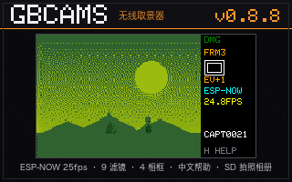

# GBCAMS — M5Cardputer 无线相机取景器

[English](README.md) · **中文**

把 **M5Cardputer** 和 **M5Stack UnitCamS3-5MP** 相机模块变成低延迟无线取景器：Game Boy 时代的
像素滤镜、SD 拍照、相册管理。不需要路由器，也不需要手机 App —— 相机直接通过 ESP-NOW 把画面推给掌机。



> 上图是真实界面的渲染图（标题用的是设备本机的 5×7 字模），不是实拍。欢迎补真机照片 —— 见 [ROADMAP](ROADMAP_CN.md)。

## 现状

| 部分 | 版本 | 状态 |
|---|---|---|
| 接收端 — M5Cardputer `cardputer/` | `v0.8.8` | ✅ 可用，已真机验证 |
| 发送端 — UnitCamS3-5MP，ESP-NOW `cams3/espnow/` | `v0.0.9` | ✅ 可用，已真机验证（推荐） |
| 发送端 — UnitCamS3-5MP，AP-HTTP `cams3/wifi/` | `v0.0.1` | ✅ 可用，已真机验证（兼容官方 App） |

实测端到端帧率：ESP-NOW 路径 **约 16–17 fps**（发送端采集可达 ~25 fps，瓶颈在接收端的 JPEG 解码
与调色板量化），AP-HTTP 路径 **约 12 fps**。这些是实测值不是目标值 —— 侧栏上的 `FPS` 字段显示实时读数。

## 功能

| | |
|---|---|
| 📡 **链路** | ESP-NOW 单播，信标自动发现，失联自动重连，无需路由器。约 12 KB 一帧拆成 9 个 ESP-NOW v2.0 大包（`PKT_DATA_MAX` 1450 B）。 |
| 🎨 **9 种像素滤镜** | `1` GB 8阶灰 · `2` Classic DMG 绿 · `3` GBC-1 8×8 Bayer · `4` GBC-2 蓝噪 · `5` GBA 15位色 · `6` BR-1 后室旧壁纸黄 · `7` BR-2 荧光灯 · `8` DMG 真四阶绿（#0F380F→#9BBC0F） · `9` 原图 |
| 🖼 **4 款像素相框** | DMG 点阵 / GBC 紫 / CRT 双线 / Polaroid。与滤镜正交（36 种组合），NVS 记忆。 |
| 🖥 **侧栏 HUD** | 画面 180×135 靠左 + 右侧 60 px 状态栏：滤镜 / 相框 / EV / 模式 / FPS / 丢帧（事件）/ 拍照文件名（事件）/ `H HELP`。**不往画面上叠任何东西**。 |
| 📸 **拍照** | `ENTER` 存 SD：滤镜关时存原始 JPEG，开滤镜时把滤镜烘进 24-bit BMP。有快门音，文件名回显在侧栏。 |
| 🗂 **相册** | 缩略图网格、批量删除、收藏、原图↔效果对比、3 秒幻灯片、元数据查看。 |
| 🈶 **双语帮助** | `H` 打开 3 页取景帮助 + 2 页相册帮助（中英对照，含链路状态诊断页）。 |
| 🔄 **双模自动识别** | 自动判断发送端跑的是哪种固件：ESP-NOW（蓝色 `ESP-NOW` 标签）或官方 AP-HTTP 路径（黄色 `AP` 标签）。 |

## 所需硬件

- **M5Cardputer** —— 接收端。ESP32-S3，8 MB flash，**无 PSRAM**（固件按它的 DRAM 预算设计）。
- **M5Stack UnitCamS3-5MP** —— 发送端。ESP32-S3 + 8 MB PSRAM，PY260 / BF3005 传感器。
- **microSD 卡**，FAT32（SPI 模式）—— 拍照用。
- 2 根 USB-C 线，刷机用。

构建使用 PlatformIO（Arduino 框架，ESP32-S3）。

## 快速开始

1. 两端各自刷固件 —— 见 [BUILDING_CN.md](BUILDING_CN.md)。M5Burner 发行包说明见
   `release/README_M5Burner.md`，merged 全镜像在 [最新 release](https://github.com/andjiang0083/gbcams/releases) 附件里。
2. 两台通电。接收端约 3 秒内出现蓝色 `ESP-NOW` 标签并出画面。
3. `1`–`9` 换滤镜，`0` 开关相框，`,` `/` 换相框款式，`-` `+` 调曝光，`ENTER` 拍照，
   `R` 进相册，`H` 看帮助。完整键位表见 [release/README.md](release/README.md)。

## 仓库结构

```
cardputer/      接收端固件 (M5Cardputer: LovyanGFX/M5GFX + TJpgDec + efontCN_12 中文字库)
cams3/espnow/   发送端固件 (UnitCamS3: ESP-NOW v2.0 大包)
cams3/wifi/     发送端固件 (UnitCamS3: AP + HTTP MJPEG, 兼容官方 App)
release/        M5Burner 发行包: manifest、320×200 封面、sha256、面向用户的说明
tools/          辅助脚本 (封面生成、蓝噪抖动表)
docs/           协议、原厂固件兼容性、设计与审查报告
archive/        早期原型，仅作历史留档，不再维护
```

## 文档

| 文档 | 内容 |
|---|---|
| [BUILDING_CN.md](BUILDING_CN.md) | 构建与刷机全流程 + 会导致黑屏的坑 |
| [release/README.md](release/README.md) | 用户手册：按键、滤镜、相册、排障 |
| [release/README_M5Burner.md](release/README_M5Burner.md) | M5Burner 发布说明 + 可直接粘贴的字段值 |
| [docs/protocol.md](docs/protocol.md) | 通信协议：包结构、发现信标、上限 |
| [docs/wifi-compat.md](docs/wifi-compat.md) | UnitCamS3 原厂固件 WiFi/API 兼容性 |
| [docs/design-v0.8.8.md](docs/design-v0.8.8.md) | v0.8.8 设计：侧栏布局、双语帮助、丢帧软接收 |
| [docs/fix-report-v0.8.7.md](docs/fix-report-v0.8.7.md) · [docs/code-review-v0.8.6.md](docs/code-review-v0.8.6.md) | 代码审查发现与修复（当"踩坑清单"读很有用） |
| [ROADMAP_CN.md](ROADMAP_CN.md) | 具体待办，看中哪条在 issue 里说一声即可认领 |
| [CHANGELOG.md](CHANGELOG.md) | 项目级变更记录 |

## 已知限制

- 瓶颈在接收端 CPU（约 16–17 fps）；发送端的采集速度比 Cardputer 能渲染的快。
- 单帧超过 **32 KB** 会被丢弃（重组缓冲有上限）。走官方 AP 路径时，接收端在连接时设定固定的画质/尺寸。
- 9 种滤镜是固定调色板，暂不支持运行时自定义。
- 只支持 ESP32 相机模块（UnitCamS3-5MP 这一类）的 JPEG 流。
- 没有 OTA，也没有配置 WiFi 的界面：AP-HTTP 发送端始终用官方 SSID `UnitCamS3-WiFi`。
- 人像模式在 v0.8.7 试过、v0.8.8 删除 —— 真机上看效果不好。没有新方案之前不会回来。
- 发行固件保留 `Serial.println` 诊断日志；但本项目自己的验收**都在屏幕上做**，因为射频忙时 USB CDC 不可靠。
  见 [CONTRIBUTING_CN.md](CONTRIBUTING_CN.md)。

## 参与

欢迎 issue 和 PR。建议先看 [CONTRIBUTING_CN.md](CONTRIBUTING_CN.md)（本项目特有约定）
和 [ROADMAP_CN.md](ROADMAP_CN.md)（到底想要什么）。Issue 表单会问定位硬件问题必需的证据，请填全。

## 署名与许可

第三方代码、字体与许可见 [CREDITS.md](CREDITS.md)。
本项目使用 **MIT** 许可 —— 见 [LICENSE](LICENSE)。
